# Something About Us

This is simple web application providing user management system with OAuth2/OIDC authentication and JWT token-based authorization.
Integrate multiple IdPs and service one server.

## Project Structure

```
├── migration/          # Database migrations
├── something_about_us/ # Main application
├── jwks/              # JWT key storage
├── config.toml        # Configuration file
├── dockerfile # Docker build file
├── docker-compose.infra.yaml # Docker infra only compose
└── docker-compose.yaml # Docker compose
```

### Configuration

Configure the following in `config.toml`:

- **Server**: Domain, port, User-Agent
- **Database**: PostgreSQL connection settings
- **Cache**: Memcached connection settings
- **JWT**: Key paths, TTL, issuer information
- **OAuth**: GitHub OAuth client credentials
- **Security**: Session cookie settings

## Getting Started

### Prerequisites

- Docker & Docker Compose
- PostgreSQL
- Memcached

### Installation & Running

1. **Setup configuration**
   ```bash
   # place in project bin or root project directory
   config.toml
   ```

2. **Setup infrastructure**
   ```bash
   # start the infrastructure
   docker-compose -f docker-compose-infra.yaml up -d
   ```

3. **Migrate database**
   ```bash
   # install sea-orm-cli
   cargo install sea-orm-cli
   # migrate
   sea-orm-cli migrate up
   ```
   >> sea-orm-cli needs database connection info

4. **Run application**
   ```bash
   # default is something_about_us
   cargo run
   ```


## API Documentation

Access Swagger UI at:

```
http://localhost:3000/swagger-ui/
```


## Tech Stack

- **Language**: Rust (Edition 2021)
- **Web Framework**: Axum
- **Database**: PostgreSQL (SeaORM)
- **Cache**: Memcached
- **Authentication**: OAuth2, JWT (EdDSA)
- **Containerization**: Docker & Docker Compose

### Infrastructure

```mermaid
graph RL
    subgraph "Web Application Server"
        direction LR
        WebApp["Rust Web Server (Axum)"]

        subgraph "Data Stores"
            Database["🗄️ PostgreSQL (User Data)"]
            Cache["⚡ Memcached (OAuth Session)"]
        end

        WebApp -- "Read/Write User Info" --- Database
        WebApp -- "Store/Load Temp Session" --- Cache
    end

    subgraph External_Identity_Providers
        GitHub["🌐 GitHub API"]
        IdP["... etc ..."]
    end

    User --- WebApp
    WebApp --- External_Identity_Providers
```



### Design Pattern

Try to adjust [hexagonal architecture](https://en.wikipedia.org/wiki/Hexagonal_architecture_(software)).


## Features

- **OAuth Authentication**: User authentication via GitHub OAuth
- **JWT Tokens**: Secure JWT token issuance and verification using EdDSA keys
- **User Management**: PostgreSQL-based user data management
- **Session Management**: Session caching with Memcached
- **RESTful API**: Web API built with Axum framework
- **API Documentation**: API documentation via Swagger UI

### Technical Notes

- **JWT Secret Generation**: Automatically generates JWT secret if not found
- **EdDSA Support**: Only supports Ed25519 algorithm for JWT signing
- **Validation**: Temporary validation rules (username max 50 bytes, config details, etc.)
- **Type Dependencies**: Crate types are coupled with dependencies (uuid, jsonwebtoken, url, etc.)
- **Test Coverage**: Test code generated by AI


### Support IdP (OAuth2.0 / OIDC)

- GitHub

### Auth Flow


## Future Improvements

### Security Enhancements
- **JWKS Rotation**: Implement automatic JWT key rotation for enhanced security
- **Security Headers**: Add comprehensive security headers (CORS, CSP, HSTS, etc.)
- **OAuth Token Revocation**: Add token revocation functionality for secure logout
- **JWT Algorithm Support**: Expand beyond Ed25519 to support additional signing algorithms

### Additional Features
- **Some Configurations hard coding and not support**: Add more configuration options (e.g., OAuth scopes, token TTLs)
- **Logging & Monitoring**: Integrate logging and monitoring tools (e.g., Prometheus, Grafana)
- **Multi-IdP Support**: Extend OAuth support to additional identity providers
- **Rate Limiting**: Implement API rate limiting for better resource protection
- **User Profile Management**: Add user profile update and management capabilities
